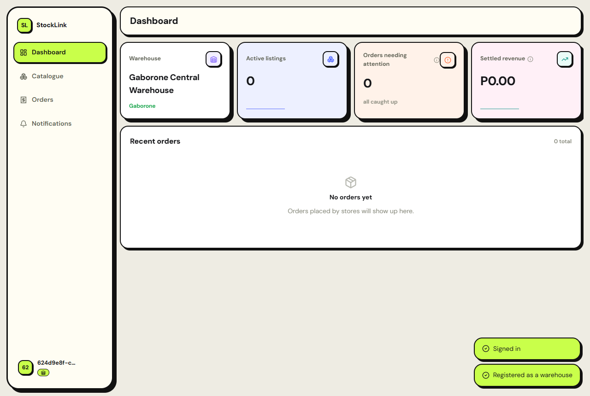
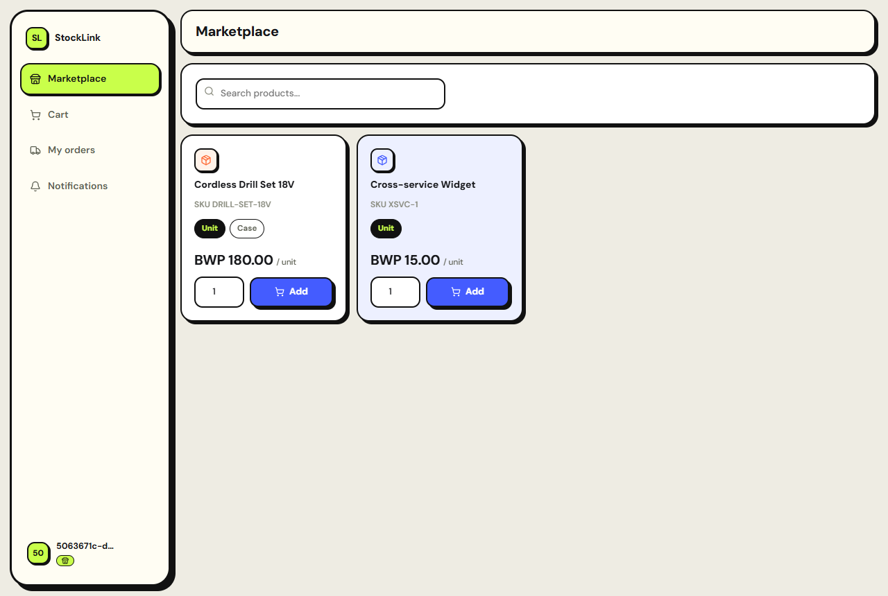
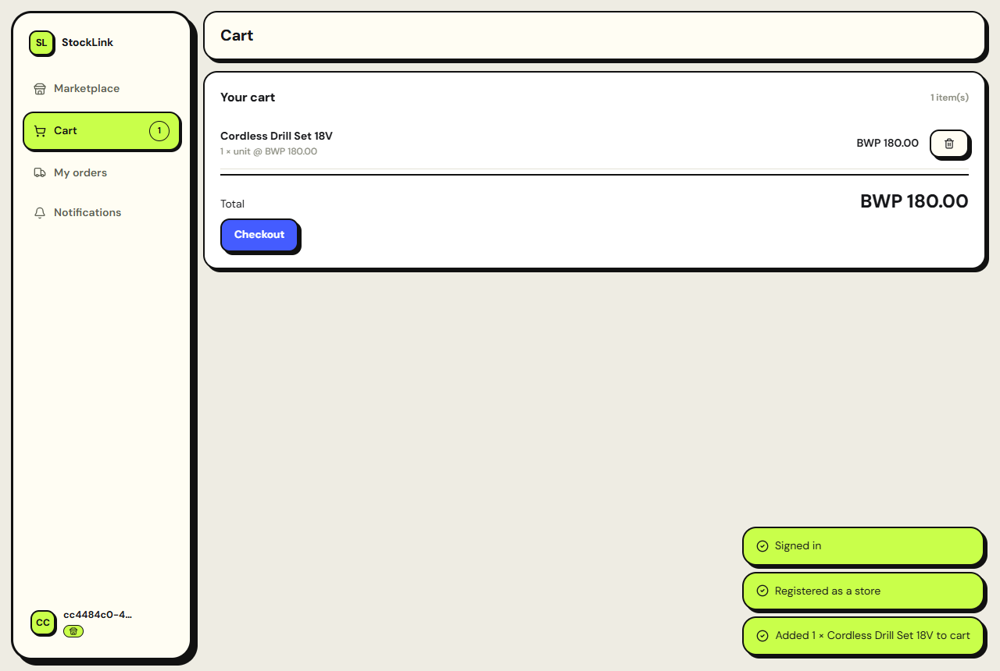
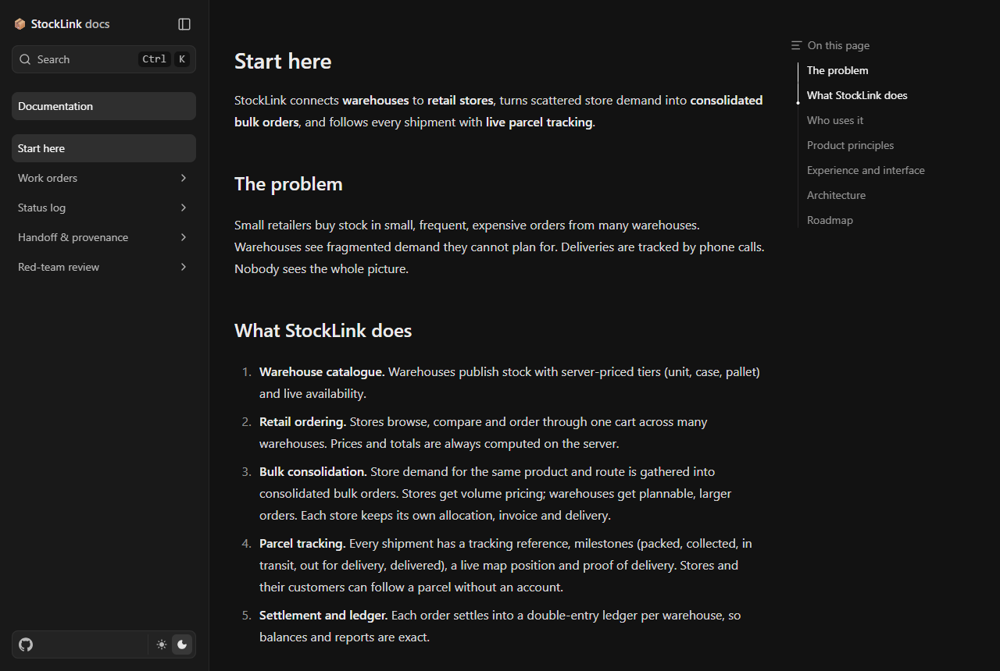

# StockLink

StockLink connects **warehouses** to **retail stores**, turns scattered store
demand into **consolidated bulk orders**, and follows every shipment with
**live parcel tracking**.

Warehouses publish server-priced stock (unit, case, pallet tiers). Stores
browse and order across many warehouses from one cart, with prices and
totals always computed server-side. Compatible store demand for the same
product and route is pooled into consolidated bulk orders, giving stores
volume pricing and warehouses plannable, larger orders, while each store
keeps its own allocation, invoice and delivery. Every shipment carries a
tracking reference, milestones, a live position and proof of delivery.

## Status

The backend is split into four independent services behind one gateway, the
web app runs against all four end-to-end, and the docs site builds and
serves from the repository's own Markdown. See [`docs/STATUS.md`](docs/STATUS.md)
for the work-order-by-work-order evidence log — what's been built, how it
was verified, and what's honestly still missing.

## Design

Thick black borders, hard offset shadows (no blur, no gradient — ever, see
`AGENTS.md`), bold flat accent colours, generous rounded corners. A floating
bottom dock replaces the sidebar below 880px instead of squeezing or
scrolling it.

## Screenshots

Real captures from the running dev stack — not mockups. See
[`docs/ONBOARDING.md`](docs/ONBOARDING.md) for the full first-run walkthrough
for both a warehouse and a store account.

| Warehouse dashboard | Marketplace |
| --- | --- |
|  |  |

| Cart → checkout | Docs site |
| --- | --- |
|  |  |

## Documentation

- [`docs/VISION.md`](docs/VISION.md) — what StockLink is, who uses it, product principles
- [`docs/ONBOARDING.md`](docs/ONBOARDING.md) — first-run guide with screenshots
- [`docs/WORK_ORDERS.md`](docs/WORK_ORDERS.md) — the ordered build plan
- [`docs/STATUS.md`](docs/STATUS.md) — evidence log, updated after every work order
- [`AGENTS.md`](AGENTS.md) — execution contract for anyone working in this repository

## Architecture

Four independent Rust/Axum services, each with its own Postgres database,
behind one nginx gateway — split by domain, not by table (see
`docs/STATUS.md`'s microservices entry for the full reasoning):

| Service | Owns |
| --- | --- |
| `identity` | accounts, OTP auth, onboarding (warehouse/store/carrier), admin console |
| `commerce` | catalogue, cart, checkout, bulk order consolidation, settlements, ledger |
| `notifications` | in-app inbox, push (FCM) |
| `media` | presigned uploads |

| Layer | Technology |
| --- | --- |
| API | Rust, Axum, sqlx, PostgreSQL (one database per service), Redis (JWT denylist, rate limiting) |
| Cross-service auth | Stateless JWT verified independently by every service; internal-only HTTP APIs (`X-Internal-Token`, never gateway-routed) for cross-service lookups |
| Zero-downtime updates | Health-gated rolling restart on plain Docker Compose (`scripts/rolling-update.mjs`) — no Kubernetes |
| Events | Transactional outbox pattern implemented in `commerce`; the Kafka publisher binary exists but isn't deployed yet — nothing currently writes to the outbox |
| Web app | React, Vite, TypeScript, TanStack Query |
| Documentation | Fumadocs/Next.js site generated from `docs/` and a committed OpenAPI snapshot |
| Local stack | Docker Compose: 4 services + Postgres + Redis + web + docs, one gateway |

## Repository layout

| Path | Contents |
| --- | --- |
| `backend/` | Rust/Axum services (`crates/{identity,commerce,notifications,media,shared}`) |
| `docker/` | Local Compose stack, gateway routing, observability provisioning |
| `docs/` | Product and process documentation, screenshots |
| `docs-site/` | Generated documentation site tooling |
| `web/` | React web app |
| `scripts/` | Provenance guard, health-gated rolling-update script |

This repository is private and contains only code written by its owner.
