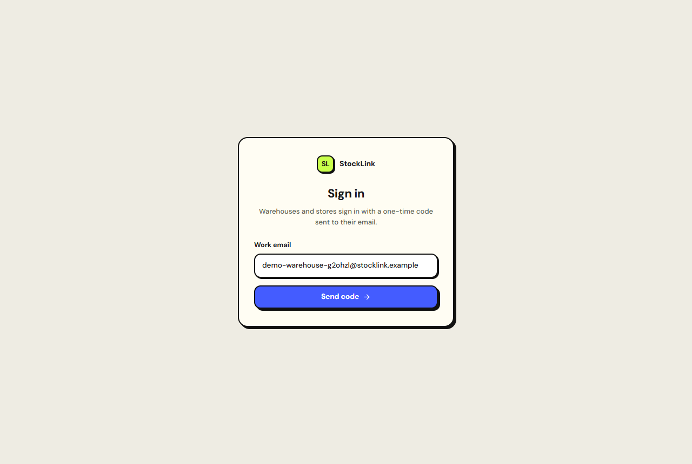
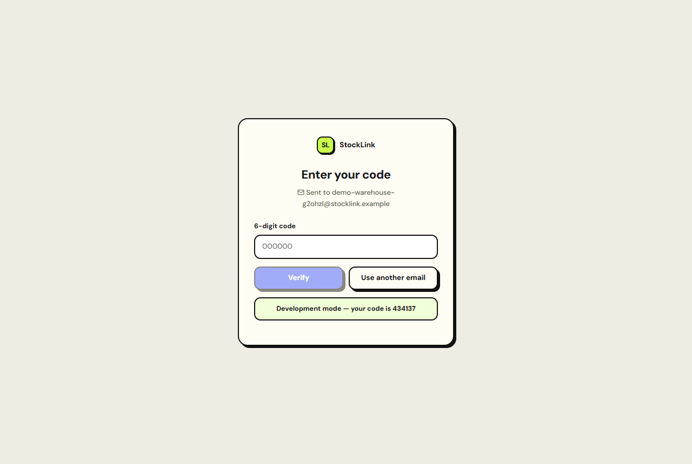
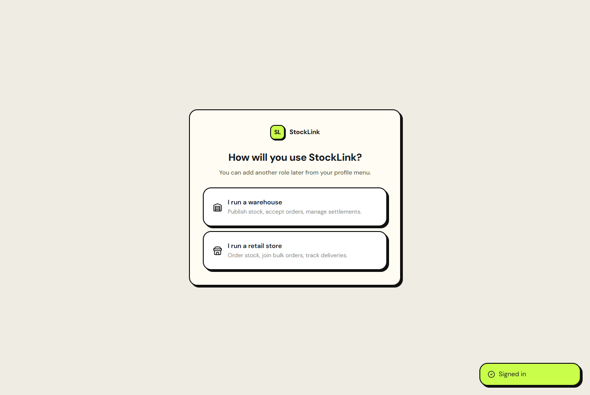
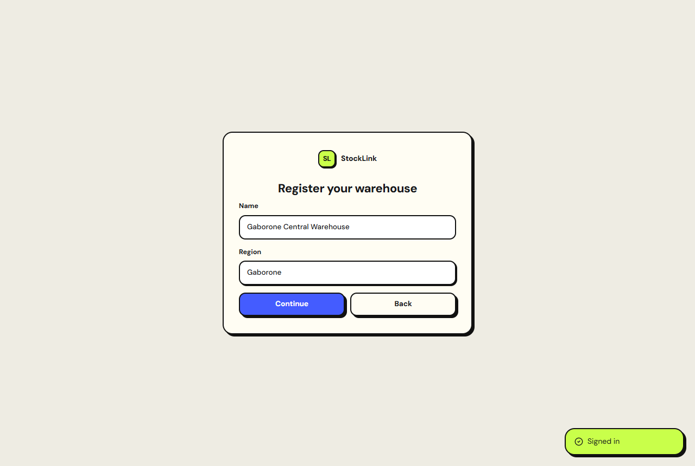
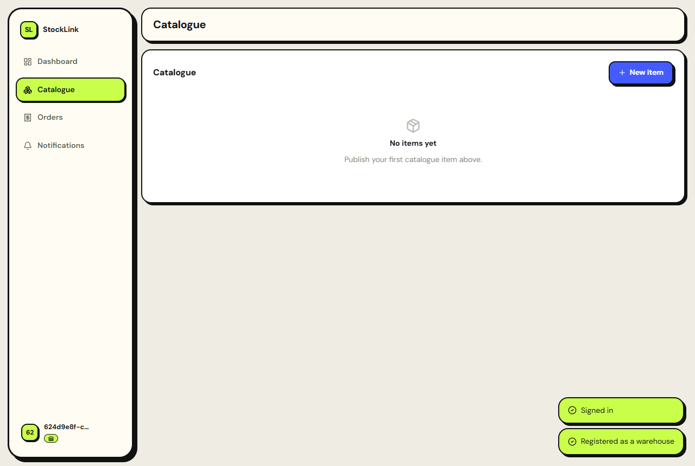
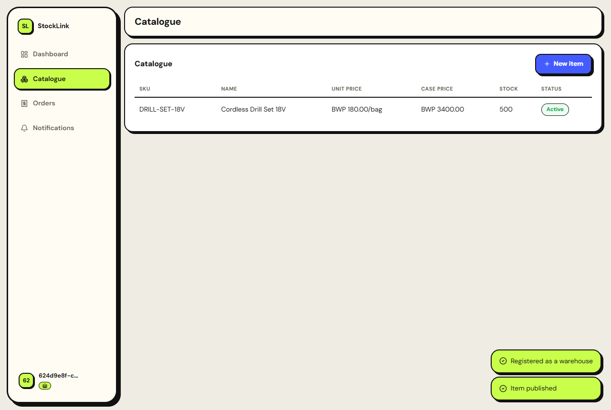
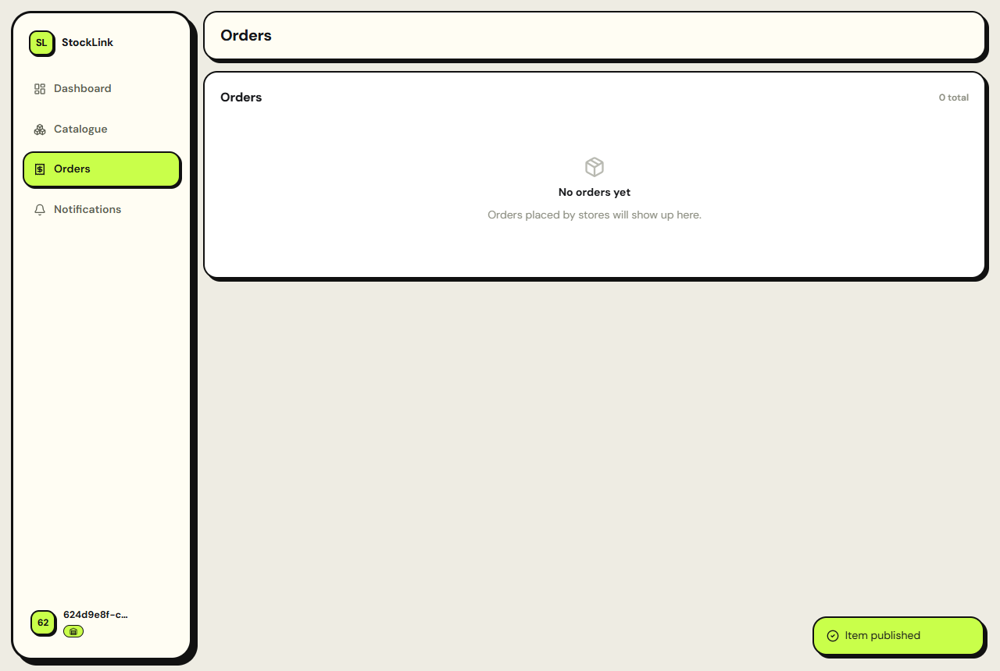
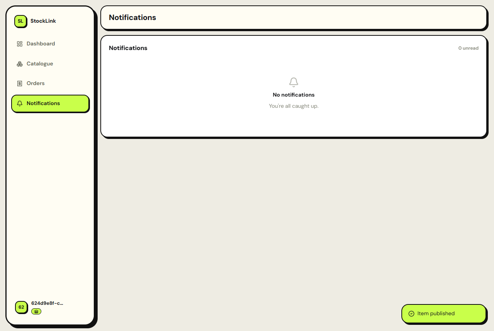
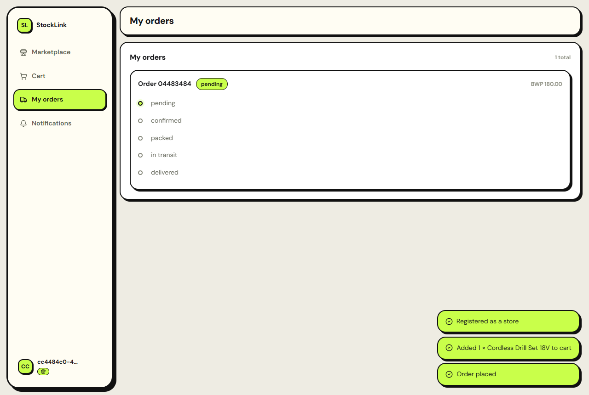

# First-run guide

A walkthrough of StockLink's actual first-run flow, captured from the
running dev stack (`docker compose -f docker/compose.dev.yml up -d --build`,
then <http://localhost:5190>) — every screenshot below is the real app, not
a mockup. There are two account types with two separate journeys; both
start the same way.

## Signing in

Every account — warehouse or store — signs in the same way: no passwords,
just a one-time code sent to a work email.

Enter a code and continue:

In development, `OTP_DEV_ECHO_ENABLED=true` (see `docker/compose.dev.yml`)
returns the code directly in the response and the app surfaces it on-screen
(the blue "Development mode" banner above) so there's nothing to wire up to
try the product locally. Demo, staging and production do not set this flag —
the code only ever reaches the real inbox.

First sign-in creates the account; there's no separate registration step.

## Choosing a role

A brand-new account has no role yet, so the first thing it sees is this
choice. An account can hold both roles at once (a business can run a
warehouse and buy through the marketplace), added later from settings.

## Warehouse: registering

Picking "I run a warehouse" asks for the two things a warehouse listing
needs — a name and a region — then grants the `warehouse` role.

## Warehouse: dashboard

Landing view for a warehouse account: its own KPIs — active listings,
orders needing attention, settled revenue — and a recent-orders feed, all
queried live from `commerce` (via `identity`'s internal ownership check, not
data typed into the browser). A brand-new warehouse genuinely shows zeros —
that's real data, not a placeholder.

## Warehouse: catalogue

Where a warehouse publishes stock at unit/case/pallet pricing tiers. Prices
set here are what checkout charges — the storefront never lets a store
override them.

After publishing an item:

## Warehouse: orders

Incoming orders against this warehouse's listings, with status advanced
from here as they're picked, shipped and delivered.

## Notifications

Shared across both account types — in-app inbox for order and settlement
events, backed by the `notifications` service.

## Store: registering and the marketplace

Picking "I run a retail store" registers a store profile instead, then
drops into the marketplace: every warehouse's published catalogue, browsable
and searchable from one screen regardless of which warehouse owns each
listing.

## Store: cart and checkout

Items from any number of warehouses collect into one cart. Checkout prices
every line server-side from the warehouse's own published tier price —
never from anything the browser sent — and splits into one order per
warehouse under one idempotency key, so a doubled click can't double an
order.

## Store: orders

A store's own order history across every warehouse it has bought from, each
independently trackable. This is the same cart from above, right after
checkout — a real order, with its status timeline starting at "pending".

## The docs site

This site — Fumadocs content generated straight from this repository's
`docs/` folder (dev-only; demo/staging/production don't serve it).

